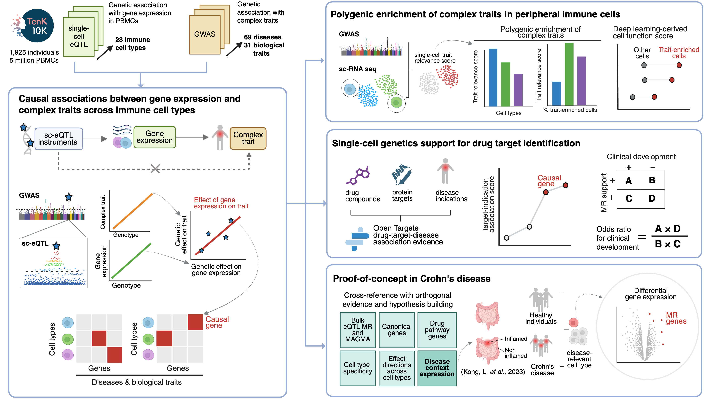

# TenK10K Phase1 causal inference manuscript


> [!NOTE]
> This repository is still under active development and will be updated from time to time

## Study design


## Overview

This repository contains code, data, and workflows for the TenK10K causal inference manuscript. The project is organized into several directories, each corresponding to a major analysis step or component.

## Directory Structure

- **`figures/`**  
  Contains figures generated for the manuscript, including study design diagrams.

- **`metadata/`**  
  Contains metadata files for traits, trait categories, and cell types from TenK10K Phase 1 sc-eQTL analysis.

- **`scripts/`**  
  Main analysis scripts, organized by analysis section:
  - **`0-preprocess/`** - Data preprocessing, GWAS and eQTL data preparation
  - **`1-overview/`** - Study overview and summary statistics  
  - **`2-mr/`** - Mendelian Randomization analyses and comparisons
  - **`3-polygenic/`** - Polygenic enrichment analyses (scDRS, scDeepID)
  - **`4-drug/`** - Drug target enrichment and therapeutic relevance
  - **`5-crohns/`** - Crohn's disease case study with matched single-cell data
  - **`util/`** - Utility functions and helper scripts

- **`workflow/`**  
  Snakemake pipeline for reproducible data processing and analysis. The workflow handles data formatting, quality control, statistical analyses, and intermediate file generation.

## Usage

### Quick Start

1. **Run the Snakemake workflow** (generates intermediate results):
   ```bash
   cd workflow/
   snakemake --profile profiles/default --cores 8
   ```

2. **Run analysis scripts** (generates figures and tables):
   ```bash
   # Preprocessing
   Rscript scripts/0-preprocess/preprocess_results.R
   
   # Overview analysis
   Rscript scripts/1-overview/study_design.R
   
   # Mendelian Randomization
   Rscript scripts/2-mr/mr_results_main.R
   
   # Polygenic analyses
   Rscript scripts/3-polygenic/scDRS/scdrs_main_supp.R
   
   # Drug target analysis
   Rscript scripts/4-drug/drug_enrichment_main.R
   
   # Crohn's disease case study
   Rscript scripts/5-crohns/figures/Figure5-combined_Crohns_figure.R
   ```

### Detailed Instructions

For detailed instructions on each analysis step, see the README files in each subdirectory:
- [`workflow/README.md`](workflow/README.md) - Snakemake pipeline setup and execution
- [`scripts/0-preprocess/README.md`](scripts/0-preprocess/README.md) - Data preprocessing
- [`scripts/1-overview/README.md`](scripts/1-overview/README.md) - Study overview and design
- [`scripts/2-mr/README.md`](scripts/2-mr/README.md) - Mendelian Randomization analysis
- [`scripts/3-polygenic/README.md`](scripts/3-polygenic/README.md) - Polygenic enrichment analysis
- [`scripts/4-drug/README.md`](scripts/4-drug/README.md) - Drug target enrichment
- [`scripts/5-crohns/README.md`](scripts/5-crohns/README.md) - Crohn's disease case study


## Data Availability

Summary statistics for single-cell eQTL and MR results will be deposited on Zenodo following manuscript publication.

## Citation

If you use this code or data in your research, please see [`CITATION.md`](CITATION.md) for citation information.

## Acknowledgments

- TenK10K study members and contributors
- Data providers and consortia (eQTLGen, GWAS consortia)
- Software developers & maintainers (Snakemake, R/Bioconductor, R Tidyverse, Python scientific computing ecosystem, MAGMA, scDRS, PLINK)
- Computational resources and support teams (Australia National Computing Infrastructure, Garvan Institute Data Science Platform)
